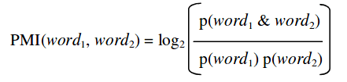
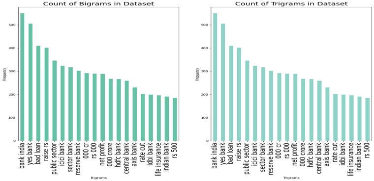

## Analyzing-Financial-News-Headlines
Sentiment Classification using Keyword-based approach and Point of Mutual Information(PMI)
* Unsupervised Classification using Turney's algorithm through Point of Mutual Information(PMI) and keyword extraction to generate training labels 
* Handling Imbalanced Dataset using Synthetic Minority Oversampling Technique(SMOTE)
* Machine Learning Techniques for Classification on Validation Data
* Visualization and Web-based Dashboarding using Streamlit

## Aim and Motivation
Financial news data can be helpful in numerous ways. It can be used in NLP projects to understand the overall scenario of the current market, analyse historical data and find cyclic trends, etc. With regard to Indian markets in particular, it faces a lot of highs and lows on a recurring basis. While numbers help in various statistical interpretations and are also readily available, they do not reveal the complete story. It is also important to analyse the trends through news sources and predict the overall sentiment of the market.

## Dataset(s)
#### [Twitter financial news feeds](https://github.com/sinhasagar507/market-sentiment-analysis/tree/master/data)
The dataset contains 50K news headlines and descriptions dating back from 2003 to May 2020. It comprises three main columns:
1. **Date** - Date of the posted news article 
2. **Title** - Headline of news article 
3. **Description** - A small description about the news article 

## Workflow
#### Exploratory Data Analysis(EDA)
   - Word Tokenization and Lemmatization 
   - Part Of Speech(POS) Tag Extraction 
   - Added lexical features such as word count, POS tags, etc.
   - Compiled a list of positive and negative sentiment keywords from the dataset and selected the most frequently occuring word(s)  
   - Caculated PMI and overall sematic orientation(SO) of the sentence with respect to these keywords  
 
#### Classification
   - Applied Multinomial Naive Byes, Random Forest, ANN and LSTMs for predicting sentiments 
   - Achieved best Macro-F1 score of 0.76 and a recall score of 0.81 

#### Deployment
   - Tried deploying the model using Streamlit and ngrok. 
   - Used Streamlit for building the UI and utlized ngrok for serving the model

#### PMI 
    
   
## Visualization sample output 
    

    
